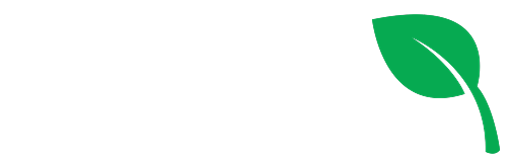

# EcoSanFco 🌲
Proyecto para que los vecinos de San Francisco puedan subir reclamos referidos a cuidado del medio ambiente, como reclamo por basural a cielo abierto, basura tirada en calles, incendios, etc

## Tecnologías utilizadas 🚀
- [Typescript](https://www.typescriptlang.org/)
- [Node.js](https://nodejs.org/en)
- [Express](https://expressjs.com/es/)
- [JWT](https://jwt.io/)
- [Mongoose](https://mongoosejs.com/)
- [MongoDB](https://www.mongodb.com/)

